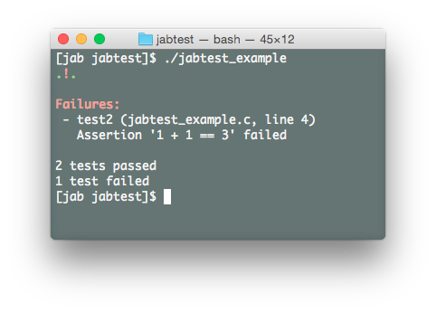

jabtest
=======

jabtest is a very small, easy-to-use library for writing simple unit tests in C.
All of its code is contained in two files (one .cpp source file and one header file)
that can easily be added to an existing project.

Here's an example of a program that uses it:

```c
#include "jabtest.h"

static TestResult test1() { ASSERT(1 + 1 == 2); return SUCCESS; } /* will succeed */
static TestResult test2() { ASSERT(1 + 1 == 3); return SUCCESS; } /* will fail */
static TestResult test3() { ASSERT(1 + 2 == 3); return SUCCESS; } /* will succeed */
    
int main(int argc, const char *argv[])
{
    run_test(test1); run_test(test2); run_test(test3);
    print_test_summary();
    return 0;
}
```



The output includes green dots representing tests that finished successfully, and
red exclamation marks representing tests that failed. A summary is then printed,
including information about the assertions that failed and the number of tests
that passed/failed.

License
=======

jabtest is open source software available under a [BSD-style license](LICENSE.md).
